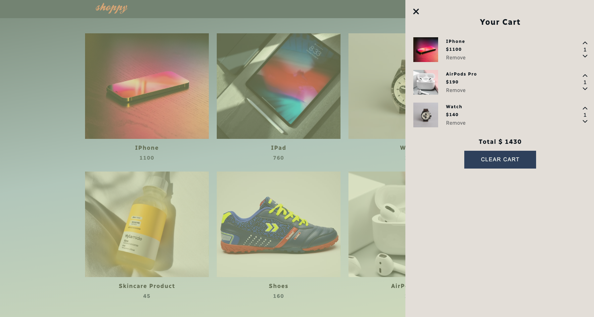

# JavaScript Contentful E-Commerce Website

A vanilla JS E-Commerce site that uses the Contentful CMS to mock the user flow through the process of browsing for items to a notional cart checkout.

## Tech Stack

**Client:** HTML5, CSS3, ES6+, SASS

**CMS:** Contentful

## Demo

App can be found at the following [link](https://js-contentful-ecommerce-site.netlify.app/).

## Screenshots

## Things I got to practice

- local storage
- event bubbling
- structure the scripting with ES6 classes
- static methods

## Roadmap

- adding authentication (i.e. Firebase)
- adding payment method (i.e. Stripe)
